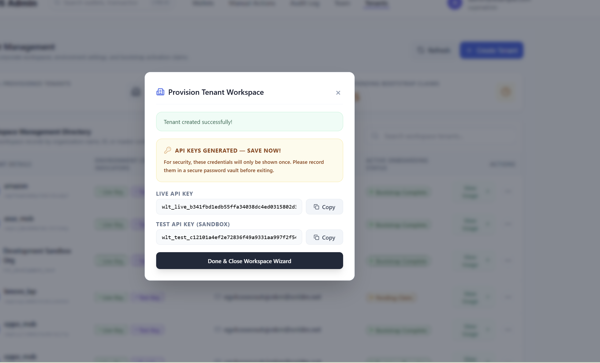
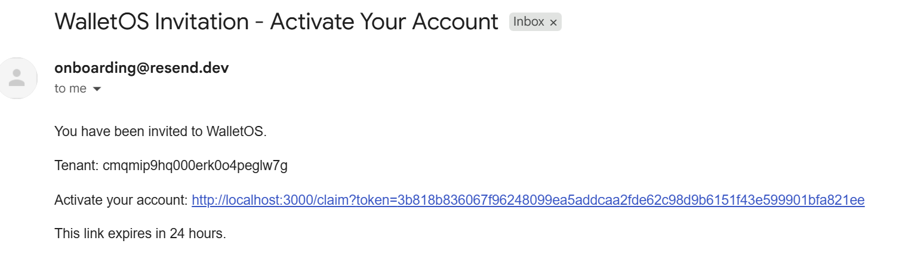
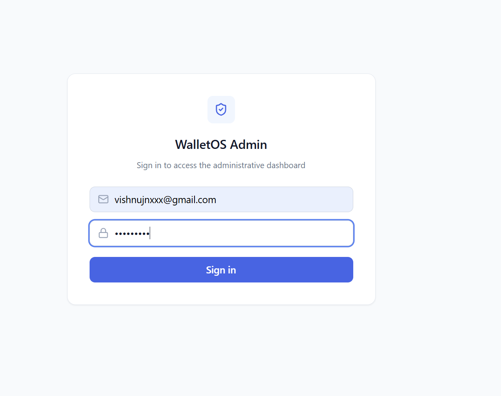
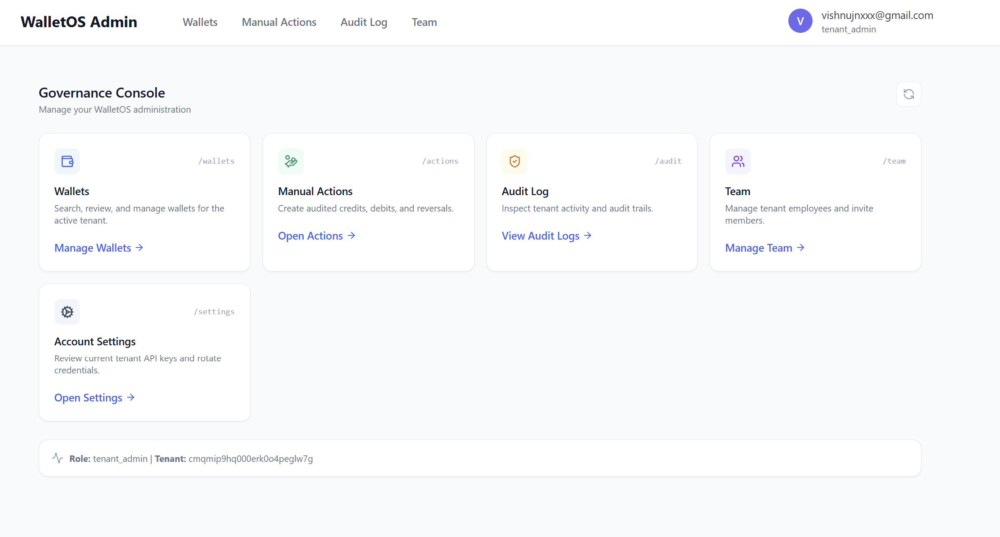
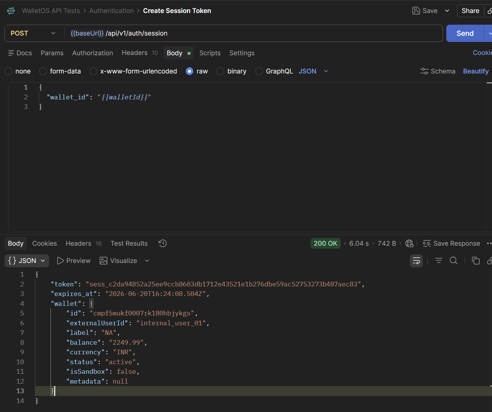
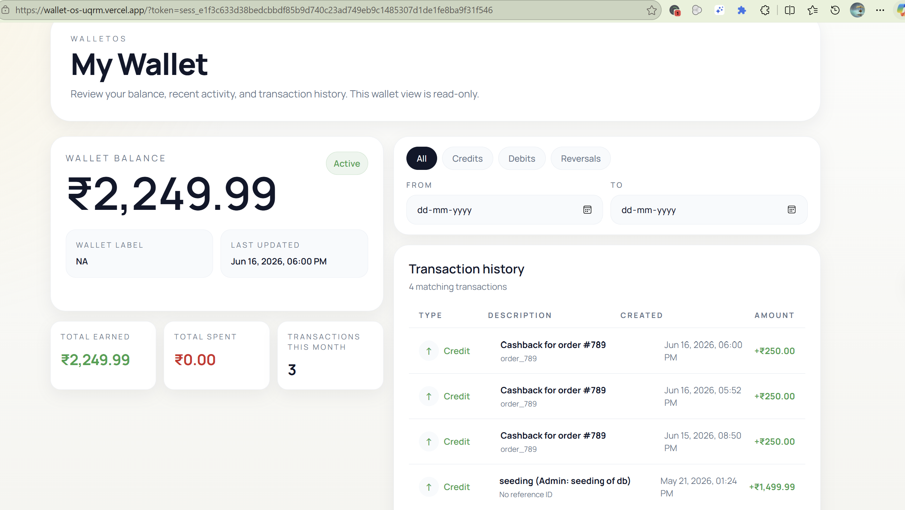

## EMAIL INVITE FLOW (RESEND)

step 1: add company name and email (once mail sent)

step 2: First add new password 
step 3: type your password and enter 

## USER FACING WEB PART

Step 1: create session token 

Step 2: add session token to the url example : https://wallet-os-uqrm.vercel.app/?token=sess_e1f3c633d38bedcbbdf85b9d740c23ad749eb9c1485307d1de1fe8ba9f31f546

